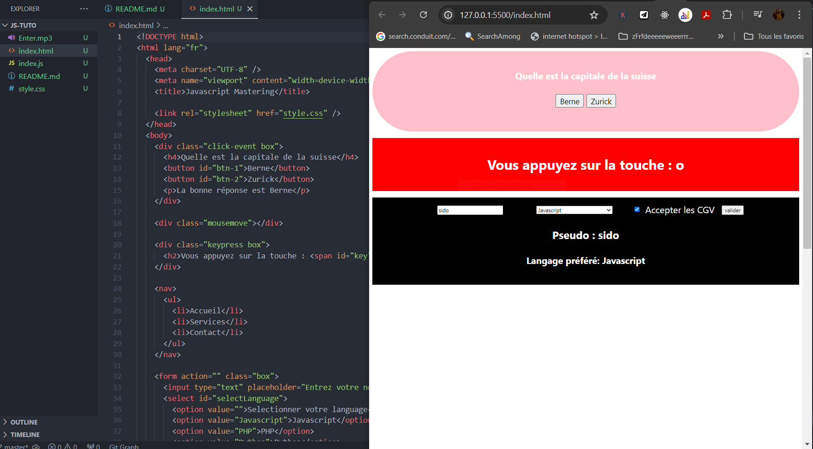

<h1>HTML, CSS et Javascript pour bien débuter </h1>

<h2>Ce TP consiste à transcrire un tuto youtube en utilisant les langages HTML, CSS et Javascript.<h2>

<a href="https://www.youtube.com/watch?v=WHodDEhcu-I">Voir tuto youtube</a>
